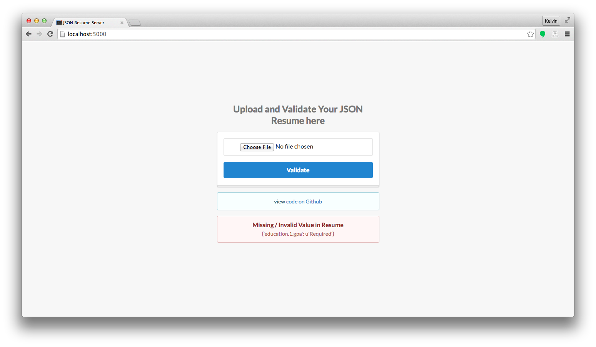

# JSON Resume Server

Sample Flask app to demonstrate how to use the [JSON Resume Validator](https://github.com/kelvintaywl/jsonresume-validator) library


Try it out at [https://jsonresume-server.herokuapp.com](https://jsonresume-server.herokuapp.com)

## Screenshot



## Instructions

- Install requirements.
```
$ pip install -r requirements.txt
```
- Run server
```
$ gunicorn server:app -b 0.0.0.0:5000
```

- Point browser to [http://localhost:5000](http://localhost:5000)
